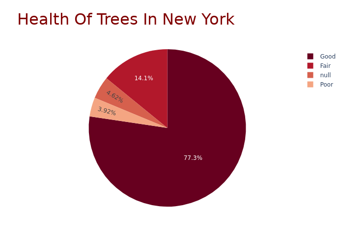

# This is my practice exercise on using Plotly

To obtain data for this practice exercise, I used BigQuery Public Dataset `bigquery-public-data.new_york_trees.tree_census_2015`.

I wrote and run the following query 👇

```sql
SELECT
  COUNT(*) AS number_trees,
  health
FROM
  `bigquery-public-data.new_york_trees.tree_census_2015`
GROUP BY
  health
ORDER BY
  number_trees DESC;
```

The final output chart is below


